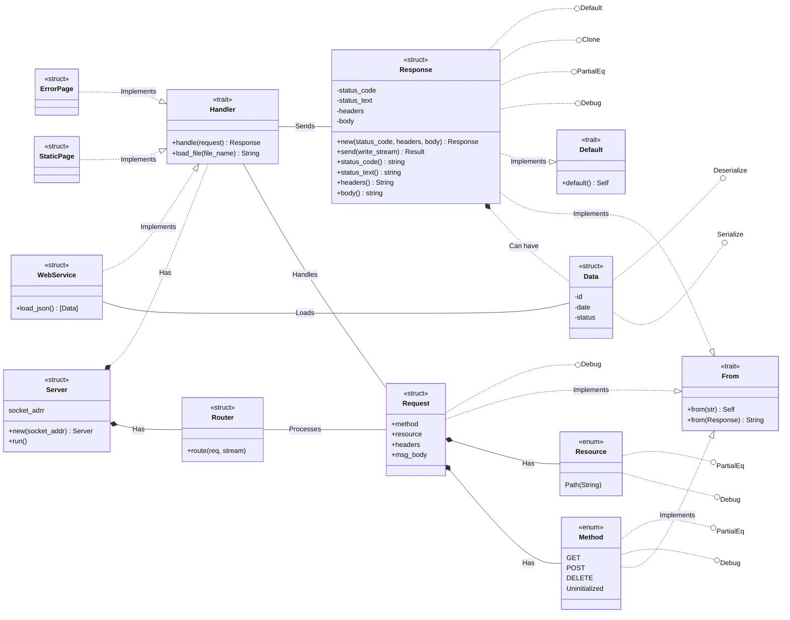
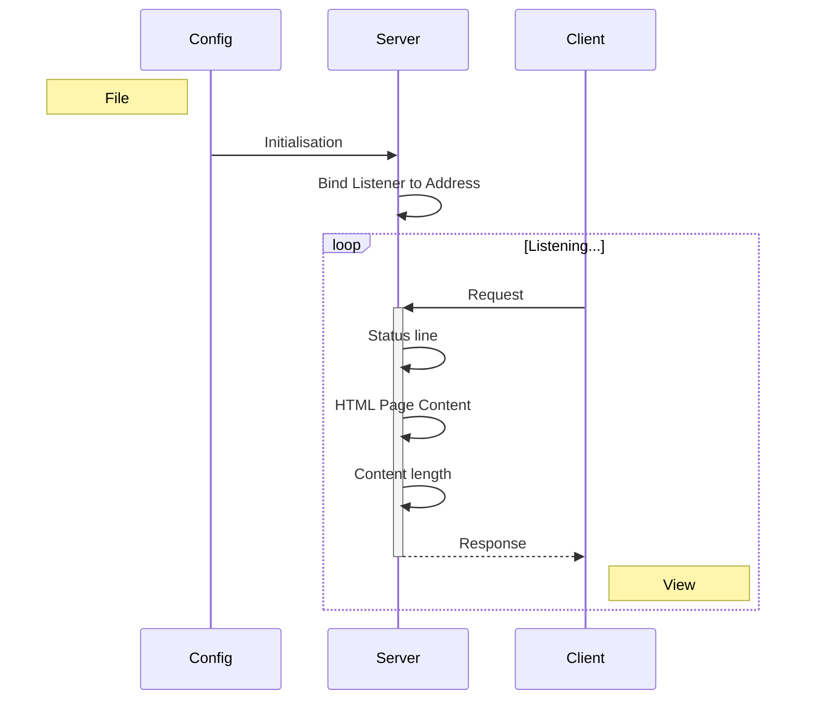

<h1 align=center>
    localhost
    <br>
    
</h1>

## Table of Contents

- [Table of Contents](#table-of-contents)
- [Tech Stack](#tech-stack)
- [Overview](#overview)
- [Installation](#installation)
  - [Cloning](#cloning)
  - [File System](#file-system)
- [Usage](#usage)
  - [Classes](#classes)
  - [Sequence](#sequence)
- [Contributors](#contributors)
  - [Authors](#authors)
  - [Peers](#peers)
  - [Testers](#testers)
  - [Auditors](#auditors)
- [License](#license)

## Tech Stack

[](./src/main.rs)
[](./scripts/gitify.sh)
[](#table-of-contents)

## Overview

## Installation

### Cloning

```shell
git clone http://learn.zone01dakar.sn/git/fakeita/localhost
Cloning into 'localhost'...
warning: redirecting to https://learn.zone01dakar.sn/git/fakeita/localhost/
remote: Enumerating objects: 15, done.
remote: Counting objects: 100% (15/15), done.
remote: Compressing objects: 100% (11/11), done.
remote: Total 15 (delta 0), reused 0 (delta 0), pack-reused 0
Receiving objects: 100% (15/15), done.

cd localhost
tree --dirsfirst

```

### File System

    --📂./
        |
        +-📂 assets/
        |       |
        |       +-🌄 ferris.svg
        |
        +-📂 config/
        |       |
        |       +-⚙️ server.toml
        |
        +-📂 pages/
        |       |
        |       +-📄 error.html
        |       +-📄 index.html
        |
        +-📂 scripts/
        |       |
        |       +-📜 gitify.sh
        |       +-📜 utils.sh
        |
        +---📂 src/
        |       |
        |       +---📂 cgi/
        |       |       |
        |       |       +-📄 handlers.rs
        |       |       +-📄 mod.rs
        |       |
        |       +--📂 http/
        |       |       |
        |       |       +-📄 mod.rs
        |       |       +-📄 request.rs
        |       |       +-📄 response.rs
        |       |       +-📄 status.rs
        |       |
        |       +-📂 server/
        |       |       |
        |       |       +-📄 config.rs
        |       |       +-📄 connection.rs
        |       |       +-📄 epoll.rs
        |       |       +-📄 handler.rs
        |       |       +-📄 mod.rs
        |       |
        |       +-📂 utils/
        |       |       |
        |       |       +-📄 error.rs
        |       |       +-📄 logging.rs
        |       |
        |       +-📄 lib.rs
        |       +-📄 main.rs
        |
        +-📂 todos/
        |       |
        |       +-📝 audit.todo
        |       +-📝 instructions.todo
        |       +-📝 rules.todo
        |       +-📝 tasks.todo
        |
        +-🚫 .gitignore
        +-🔒 Cargo.lock
        +-⚙️ Cargo.toml
        +-🔑 LICENSE
        +-📖 README.md
        +-⚙️ rustfmt.toml

## Usage

### Classes



### Sequence



## Contributors

### Authors

[](http://learn.zone01dakar.sn/git/fakeita)
[](http://learn.zone01dakar.sn/git/jefaye)

### Peers

[](http://learn.zone01dakar.sn/git/npouille)

### Testers

### Auditors

## License

[](LICENSE)
