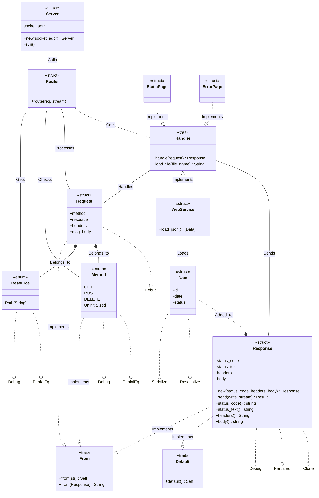
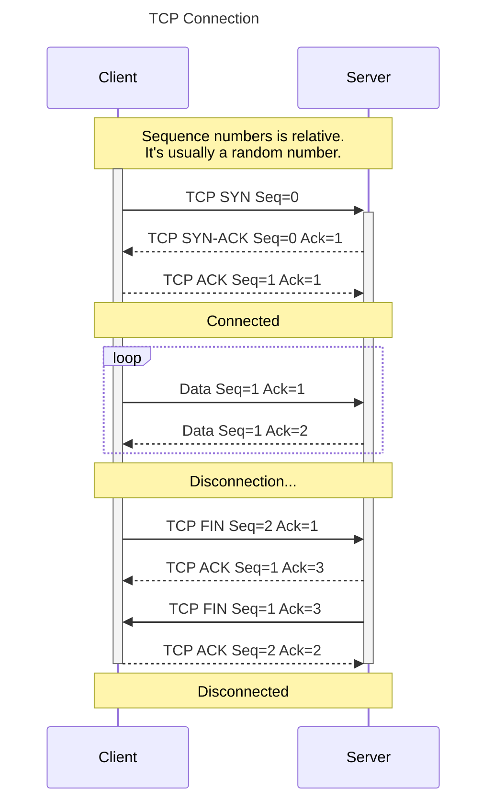
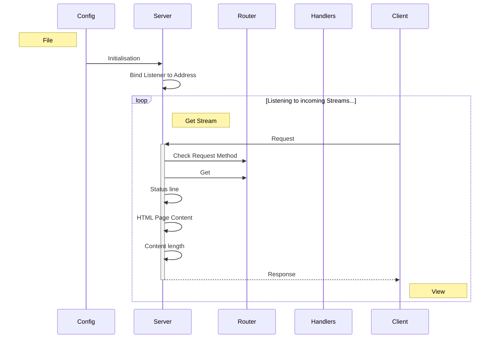

<h1 align=center>
    localhost
    <br>
    
</h1>

## Table of Contents

- [Table of Contents](#table-of-contents)
- [Tech Stack](#tech-stack)
- [Overview](#overview)
  - [TCP Header](#tcp-header)
- [Installation](#installation)
  - [Cloning](#cloning)
  - [File System](#file-system)
- [Architecture](#architecture)
  - [Classes](#classes)
  - [Sequence](#sequence)
- [Usage](#usage)
- [Contributors](#contributors)
  - [Authors](#authors)
  - [Peers](#peers)
  - [Testers](#testers)
  - [Auditors](#auditors)
- [License](#license)

## Tech Stack

[](./src/main.rs)
[](./scripts/gitify.sh)
[](#table-of-contents)

## Overview

### TCP Header

  ```mermaid
  ---
  title: "TCP Packet"
  ---
  packet-beta
  0-15: "Source Port"
  16-31: "Destination Port"
  32-63: "Sequence Number"
  64-95: "Acknowledgment Number"
  96-99: "Data Offset"
  100-105: "Reserved"
  106: "URG"
  107: "ACK"
  108: "PSH"
  109: "RST"
  110: "SYN"
  111: "FIN"
  112-127: "Window"
  128-143: "Checksum"
  144-159: "Urgent Pointer"
  160-191: "(Options and Padding)"
  192-255: "Data (variable length)"
```

## Installation

### Cloning

```shell
git clone http://learn.zone01dakar.sn/git/fakeita/localhost
Cloning into 'localhost'...
warning: redirecting to https://learn.zone01dakar.sn/git/fakeita/localhost/
remote: Enumerating objects: 15, done.
remote: Counting objects: 100% (15/15), done.
remote: Compressing objects: 100% (11/11), done.
remote: Total 15 (delta 0), reused 0 (delta 0), pack-reused 0
Receiving objects: 100% (15/15), done.

cd localhost
tree --dirsfirst
```

### File System
```
📂./
  |
  +-📂 /assets
  |       |
  |       +-🌄 ferris.svg
  |
  +-📂 /config
  |       |
  |       +-⚙️ server.toml
  |
  +-📂 /data
  |       |
  |       +-📄 data.json
  |
  +-📂 /scripts
  |       |
  |       +-📜 gitify.sh
  |       +-📜 utils.sh
  |
  +---📂 /src
  |       |
  |       +--📂 /http
  |       |       |
  |       |       +-📂 /request
  |       |       |       |
  |       |       |       +-📄 method.rs
  |       |       |       +-📄 mod.rs
  |       |       |       +-📄 utils.rs
  |       |       |
  |       |       +-📂 /response
  |       |       |       |
  |       |       |       +-📄 func.rs
  |       |       |       +-📄 mod.rs
  |       |       |
  |       |       +-📄 mod.rs
  |       |
  |       +-📂 /server
  |       |       |
  |       |       +-📂 /handler
  |       |       |       |
  |       |       |       +-📄 mod.rs
  |       |       |       +-📄 static_page.rs
  |       |       |       +-📄 web_service.rs
  |       |       |
  |       |       +-📄 mod.rs
  |       |       +-📄 router.rs
  |       |
  |       +-📄 lib.rs
  |       +-📄 main.rs
  |
  +-📂 /templates
  |       |
  |       +-📄 error.html
  |       +-📄 index.html
  |
  +-📂 /tests
  |       |
  |       +-📄 request_test.rs
  |       +-📄 response_test.rs
  |
  +-📂 /todos
  |       |
  |       +-📝 audit.todo
  |       +-📝 instructions.todo
  |       +-📝 rules.todo
  |       +-📝 tasks.todo
  |
  +-🚫 .gitignore
  +-🔒 Cargo.lock
  +-⚙️ Cargo.toml
  +-🔑 LICENSE
  +-📖 README.md
  +-⚙️ rustfmt.toml
```

## Architecture

```mermaid
architecture-beta
  group localhost(logos:google-home)[localhost]
  group source(logos:rust)[source] in localhost
  group server(server)[server] in source
  group http(internet)[http] in source

  service config(logos:toml)[config] in localhost
  service templates(logos:html-5)[templates] in localhost
  service data(logos:json)[data] in localhost

  service loader(logos:aws-config)[loader] in source
  service root(server)[root] in  server
  service request(internet)[request] in http
  service response(internet)[response] in http
  service router(logos:aws-opsworks)[router] in server
  service handlers(logos:aws-step-functions)[handlers] in server
  junction builder in localhost

  config:B --> T:loader
  loader:R --> L:root
  request:L --> R:root
  root:B --> T:router
  router:B --> T:handlers
  builder:T --> B:handlers
  templates:L -- R:builder
  data:R -- L:builder
  handlers:R --> L:response
```



### Classes



### Sequence





## Usage

## Contributors

### Authors

[](http://learn.zone01dakar.sn/git/fakeita)
[](http://learn.zone01dakar.sn/git/jefaye)

### Peers

[](http://learn.zone01dakar.sn/git/npouille)

### Testers

### Auditors

## License

[](LICENSE)
