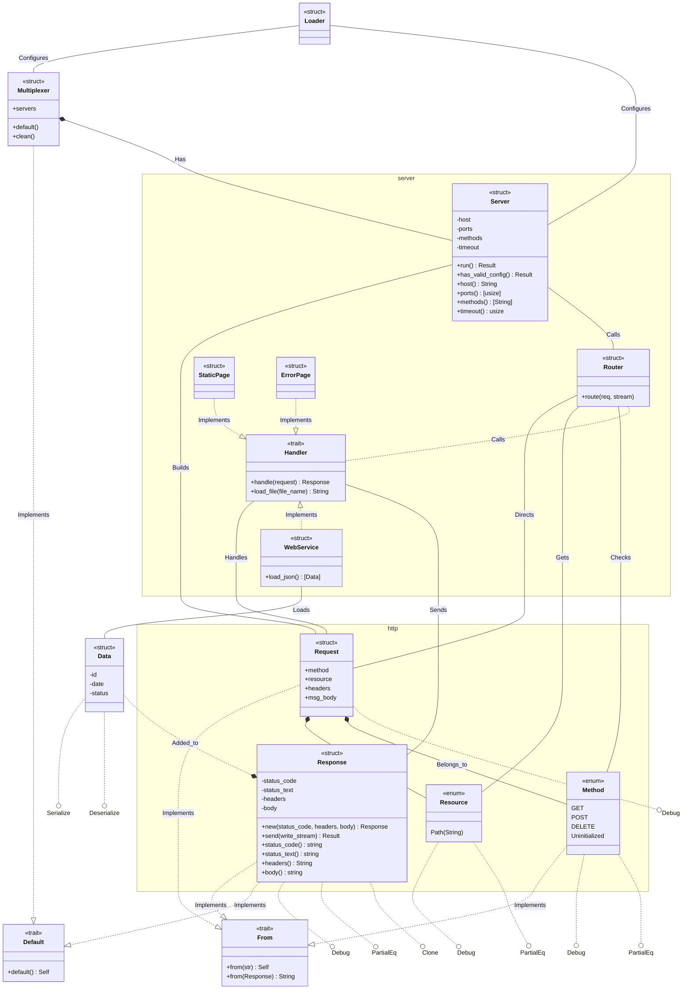
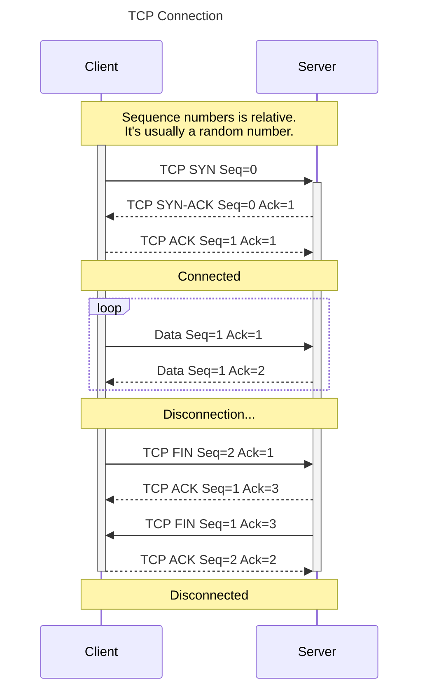

<h1 align=center>
    localhost
    <br>
    
</h1>

## Table of Contents

- [Table of Contents](#table-of-contents)
- [Tech Stack](#tech-stack)
- [Overview](#overview)
  - [TCP Header](#tcp-header)
- [Installation](#installation)
  - [Cloning](#cloning)
  - [File System](#file-system)
- [Architecture](#architecture)
  - [Classes](#classes)
  - [Sequence](#sequence)
- [Usage](#usage)
- [Contributors](#contributors)
  - [Authors](#authors)
  - [Peers](#peers)
  - [Testers](#testers)
  - [Auditors](#auditors)
- [License](#license)

## Tech Stack

[](./src/main.rs)
[](./scripts/gitify.sh)
[](#table-of-contents)

## Overview

### TCP Header

  ```mermaid
  ---
  title: "TCP Packet"
  ---
  packet-beta
  0-15: "Source Port"
  16-31: "Destination Port"
  32-63: "Sequence Number"
  64-95: "Acknowledgment Number"
  96-99: "Data Offset"
  100-105: "Reserved"
  106: "URG"
  107: "ACK"
  108: "PSH"
  109: "RST"
  110: "SYN"
  111: "FIN"
  112-127: "Window"
  128-143: "Checksum"
  144-159: "Urgent Pointer"
  160-191: "(Options and Padding)"
  192-255: "Data (variable length)"
```

## Installation

### Cloning

```shell
git clone https://learn.zone01dakar.sn/git/fakeita/localhost
Cloning into 'localhost'...
remote: Enumerating objects: 15, done.
remote: Enumerating objects: 549, done.
remote: Counting objects: 100% (549/549), done.
remote: Compressing objects: 100% (509/509), done.
remote: Total 549 (delta 245), reused 0 (delta 0), pack-reused 0
Receiving objects: 100% (549/549), 100.22 KiB | 1.86 MiB/s, done.
Resolving deltas: 100% (245/245), done.

cd localhost
tree --dirsfirst
```

### File System
```
📂./
  |
  +-📂 /assets
  |       |
  |       +-🌄 ferris.svg
  |
  +-📂 /config
  |       |
  |       +-⚙️ server.toml
  |
  +-📂 /data
  |       |
  |       +-📄 data.json
  |
  +-📂 /templates
  |       |
  |       +-📄 error.html
  |       +-📄 index.html
  |
  +-📂 /scripts
  |       |
  |       +-📜 gitify.sh
  |       +-📜 utils.sh
  |
  +---📂 /src
  |       |
  |       +--📂 /http
  |       |       |
  |       |       +-📂 /request
  |       |       |       |
  |       |       |       +-📄 method.rs
  |       |       |       +-📄 mod.rs
  |       |       |       +-📄 utils.rs
  |       |       |
  |       |       +-📂 /response
  |       |       |       |
  |       |       |       +-📄 func.rs
  |       |       |       +-📄 mod.rs
  |       |       |
  |       |       +-📄 mod.rs
  |       |
  |       +-📂 /server
  |       |       |
  |       |       +-📂 /handler
  |       |       |       |
  |       |       |       +-📄 mod.rs
  |       |       |       +-📄 static_page.rs
  |       |       |       +-📄 web_service.rs
  |       |       |
  |       |       +-📄 mod.rs
  |       |       +-📄 router.rs
  |       |
  |       +-📄 lib.rs
  |       +-📄 loader.rs
  |       +-📄 main.rs
  |       +-📄 mux.rs
  |
  +-📂 /tests
  |       |
  |       +-📄 request_test.rs
  |       +-📄 response_test.rs
  |
  +-📂 /todos
  |       |
  |       +-📝 audit.todo
  |       +-📝 instructions.todo
  |       +-📝 rules.todo
  |       +-📝 tasks.todo
  |
  +-🚫 .gitignore
  +-🔒 Cargo.lock
  +-⚙️ Cargo.toml
  +-🔑 LICENSE
  +-📖 README.md
  +-⚙️ rustfmt.toml
```

## Architecture

```mermaid
architecture-beta

  group localhost(logos:rust)[localhost]
  group source(logos:rust)[source] in localhost
  group servers(logos:rust)[servers] in source
  group http(logos:rust)[http] in source

  service config(logos:toml)[config] in localhost
  service templates(logos:html-5)[templates] in localhost
  service data(logos:json)[data] in localhost

  service loader(logos:aws-config)[loader] in source
  service multiplexer(server)[multiplexer] in source

  service root(server)[root] in  servers
  service middlewares(logos:aws-lambda)[middlewares] in servers
  service router(logos:react-router)[router] in servers
  service handlers(logos:aws-step-functions)[handlers] in servers

  service requests(internet)[requests] in http
  service sessions(internet)[sessions] in http
  service responses(internet)[responses] in http

  junction builder in localhost

  config:R --> L:loader
  loader:R --> L:multiplexer
  requests:L --> R:multiplexer
  multiplexer:B --> T:root
  root:R <-- L:sessions
  root:L --> R:middlewares
  middlewares:B --> T:router
  router:R --> L:handlers
  builder:T --> B:handlers
  templates:L -- R:builder
  data:R -- L:builder
  handlers:R --> L:responses
```



### Classes



### Sequence



## Usage

```shell
cargo r
   Compiling memchr v2.7.4
   Compiling siphasher v1.0.1
   Compiling serde v1.0.217
   Compiling regex-syntax v0.8.5
   Compiling phf_shared v0.11.3
   Compiling phf_generator v0.11.3
   Compiling aho-corasick v1.1.3
   Compiling phf_codegen v0.11.3
   Compiling phf v0.11.3
   Compiling thiserror v2.0.11
   Compiling crossbeam-utils v0.8.21
   Compiling regex-automata v0.4.9
   Compiling libc v0.2.169
   Compiling cfg-if v1.0.0
   Compiling ucd-trie v0.1.7
   Compiling byteorder v1.5.0
   Compiling pest v2.7.15
   Compiling getrandom v0.2.15
   Compiling zerocopy v0.7.35
   Compiling crossbeam-epoch v0.9.18
   Compiling chrono-tz-build v0.3.0
   Compiling bstr v1.11.3
   Compiling same-file v1.0.6
   Compiling log v0.4.25
   Compiling unic-common v0.9.0
   Compiling unic-char-range v0.9.0
   Compiling unic-ucd-version v0.9.0
   Compiling pest_meta v2.7.15
   Compiling unic-char-property v0.9.0
   Compiling globset v0.4.15
   Compiling walkdir v2.5.0
   Compiling chrono-tz v0.9.0
   Compiling num-traits v0.2.19
   Compiling ppv-lite86 v0.2.20
   Compiling crossbeam-deque v0.8.6
   Compiling rand_core v0.6.4
   Compiling hashbrown v0.15.2
   Compiling iana-time-zone v0.1.61
   Compiling equivalent v1.0.2
   Compiling chrono v0.4.39
   Compiling rand_chacha v0.3.1
   Compiling ignore v0.4.23
   Compiling indexmap v2.7.1
   Compiling pest_generator v2.7.15
   Compiling unic-ucd-segment v0.9.0
   Compiling libm v0.2.11
   Compiling toml_datetime v0.6.8
   Compiling serde_spanned v0.6.8
   Compiling bitflags v2.8.0
   Compiling itoa v1.0.14
   Compiling ryu v1.0.19
   Compiling deunicode v1.6.0
   Compiling winnow v0.7.2
   Compiling serde_json v1.0.138
   Compiling globwalk v0.9.1
   Compiling slug v0.1.6
   Compiling humansize v2.1.3
   Compiling unic-segment v0.9.0
   Compiling pest_derive v2.7.15
   Compiling rand v0.8.5
   Compiling regex v1.11.1
   Compiling toml_edit v0.22.24
   Compiling percent-encoding v2.3.1
   Compiling lazy_static v1.5.0
   Compiling tera v1.20.0
   Compiling toml v0.8.20
   Compiling localhost v0.1.0 (/home/student/localhost)
    Finished `dev` profile [unoptimized + debuginfo] target(s) in 33.53s
     Running `target/debug/localhost`
```

## Contributors

### Authors

[](http://learn.zone01dakar.sn/git/fakeita)
[](http://learn.zone01dakar.sn/git/jefaye)

### Peers

[](http://learn.zone01dakar.sn/git/npouille)

### Testers

### Auditors

## License

[](LICENSE)
