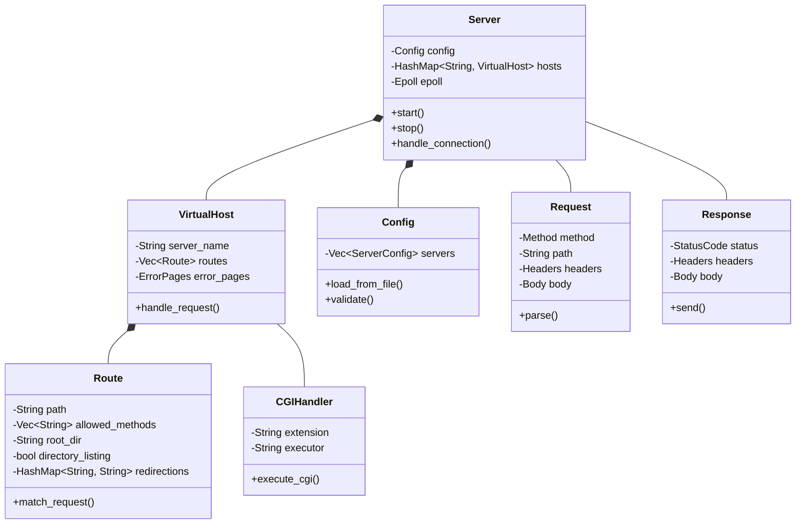

```mermaid
classDiagram
    class Server {
        -Config config
        -HashMap~String, VirtualHost~ hosts
        -Epoll epoll
        +start()
        +stop()
        +handle_connection()
    }

    class VirtualHost {
        -String server_name
        -Vec~Route~ routes
        -ErrorPages error_pages
        +handle_request()
    }

    class Config {
        -Vec~ServerConfig~ servers
        +load_from_file()
        +validate()
    }

    class Route {
        -String path
        -Vec~String~ allowed_methods
        -String root_dir
        -bool directory_listing
        -HashMap~String, String~ redirections
        +match_request()
    }

    class Request {
        -Method method
        -String path
        -Headers headers
        -Body body
        +parse()
    }

    class Response {
        -StatusCode status
        -Headers headers
        -Body body
        +send()
    }

    class CGIHandler {
        -String extension
        -String executor
        +execute_cgi()
    }

    Server *-- VirtualHost
    Server *-- Config
    VirtualHost *-- Route
    Server -- Request
    Server -- Response
    VirtualHost -- CGIHandler
```